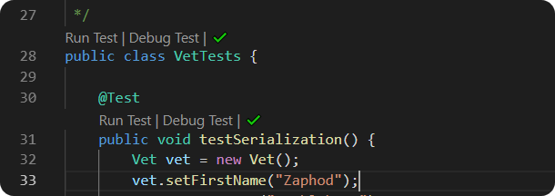

# Marte

## Executando

#### Programa

Para executar esse programa você dever ter os seguintes recursos:

- [Java](https://www.java.com/pt-BR/download/)
- [Javac](https://www.oracle.com/technetwork/pt/java/javase/downloads/index.html)

Dentro da pasta do repositório, execute o seguinte comando na linha de comando:

```
javac Principal.java Mars.java Utils.java Sonda.java
```

```
java Principal
```

#### Testes

Para executar os testes você deve ter os seguintes recursos:

- [JUnit](https://search.maven.org/search?q=g:junit%20AND%20a:junit)
- [VS Code](https://code.visualstudio.com/download)

Abra as configurações do Visual Studio Code no modo texto e insira a seguinte configuração:

```
"java.project.referencedLibraries": [
		"lib/**/*.jar",
		"path/to/junit/.jar"
	]
```

Abra o arquivo **Tests.java** e execute os testes



Imagem retirada do site oficial do VSCode.

## Interação

##### Tamanho do Planeta

```
Insira as coordenadas do canto superior direito:
5 5
```

- Insira as coordenadas do canto superior direito em coordeanadas do plano cartesiano.

##### Opções de Comando

```
Insira o comando que deseja executar: (adicionar, mover, mapa, relatório, sair)
> <comando>
```

- ###### Adicionar

```
Insira as coordenadas da sonda e a orientação: EX: 1 2 N
> 1 2 N
Insira o ID da sonda
> 404
```

- - Insira as coordenadas no plano cartesiano da sonda que deseja inserir.
- - Insira o ID(int) da sonda que está sendo adicionada.

* ###### Mover

```
Insira os ID da sonda que deseja mover:
> 404
Insira os comandos de movimentação da sonda:
> MMLMRLRL
```

- - Insira o ID da sonda que deseja movimentar.
- - Insira os comandos de movimentação da sonda M(move), R(right), L(left).

* ###### Mapa

```
---------------------------
0     0     0     0     0     0
404   0     0     0     0     0
0     0     0     0     0     0
0     0     0     0     0     0
0     0     0     0     0     0
0     0     0     0     0     0
---------------------------
```

- - Desenha no console uma representação do planeta no momento atual, cada sonda é representada por seu ID.

* ###### Relatório

```
Sonda : 404 com coordenadas 1 2 N
Sonda : 27 com coordenadas 3 3 S
Sonda : 300 com coordenadas 5 0 W
Sonda : 4 desativada.
Sonda : 33 desativada.
```

- - Apresenta um relatório de todas sondas adicionadas no planeta, apresentando informações sobre suas coordenadas caso estejam ativas.

## Interação entre as Sondas

Observe a seguinte a situação:

##### Mapa:

```
---------------------------
0  2  0
0  1  0
0  0  0
---------------------------
```

##### Relatório:

```
Sonda : 1 com coordenadas 1 1 N
Sonda : 2 com coordenadas 1 2 S
```

Com isso temos que as sondas estão prestes a se chocar. Nesse cenário temos duas resoluções, uma otimista, e uma nem tanto.

###### Otimista:

Vamos observar o cenário otimista, ao movimentarmos a sonda 1 ao norte temos o seguinte resultado:

```
ERRO
COLISÂO IMINENTE!
ABORTAR MISSÂO
O PILOTO DESVIOU E SAIU ILESO
```

E ao observarmos o mapa temos o seguinte resultado:

```
---------------------------
0  2  0
0  0  0
0  1  0
---------------------------
```

Ou seja, a sonda 1 ao tentar seguir rumo ao norte se deparou com a sonda 2, porém com muita _sorte_ conseguiu desviar a sonda e prossegui sua trajetória ao norte.

###### Pessimista:

Entretanto, nem todas sondas podem ter essa sorte, vamos analisar o caso em que isso não ocorre.

```
ERRO
COLISÂO IMINENTE!
ABORTAR MISSÂO
PERDEMOS A COMUNICAÇÃO DA SONDA 1 E DA SONDA 2
```

E ao observarmos o mapa temos o seguinte resultado:

```
---------------------------
0  0  0
0  0  0
0  0  0
---------------------------
```

Assim, como o relatório:

```
Sonda : 1 desativada.
Sonda : 2 desativada.
```

Ou seja, a sonda 1 colide com a sonda 2 e ambas perdem a comunicação com a central.

## Detalhes Técnicos

### Princípio do Sistema de Navegação

Para o sistema de navegação da sonda funcionar adequadamente foi implementado um sistema de conversão, onde o usuário passa as informações no formato de um plano cartesiano, entretanto o programa armezana e manipula as informações como uma matriz, para isso precisamos entender algumas regras:

##### C(X,Y) = M(N-Y-1,X) = M(i,j)

- A posição da coordenada **X** corresponde a coluna _j_ .
- A posição da coordenada **Y** corresponde a linha _K_
- K é dado da seguinte forma. _K_ = tamanho do plano - linha _i_ - 1
- N é a ordem do plano.

Portanto alguns exemplos em um plano de ordem 5x5:

- C(0,0) = M(5-0-1, 0) = M(4,0)
- C(0,4) = M(5-4-1, 0) = M(0,0)

### Sorte na interação entre as Sondas

Para determinar se uma Sonda consegue ou não desviar de uma colisão iminente utilizamos um valor booleano aleatório gerado pelo Pacote Random implementado em Java. Ao utilizarmos o valor booleano para determinar o resultado da interação temos que a sonda tem _50%_ de chance de desviar e _50%_ de chance de colidir.
